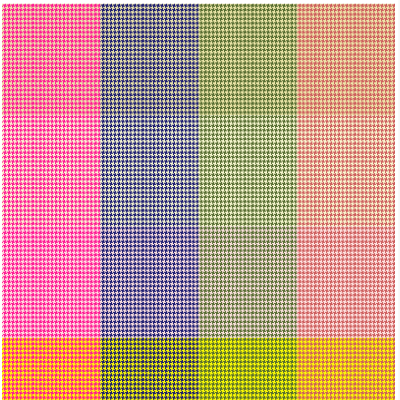

# chidorify

chidorify is check pattern maker.



# Install

```
git clone https://github.com/niiyz/chidorify.git
cd chidorify
npm install
npm run test # Browser access to http://localhost:3000/
```

## Example

``` js
'use strict';

import { Chidorify } from '../chidorify';

const design = [
    [0, 1, 1, 0, 0, 1, 1, 0],
    [1, 1, 0, 0, 1, 1, 0, 0],
    [1, 0, 0, 1, 1, 0, 0, 1],
    [0, 0, 1, 1, 0, 0, 1, 1],
    [0, 1, 1, 0, 0, 1, 1, 0],
    [1, 1, 0, 0, 1, 1, 0, 0],
    [1, 0, 0, 1, 1, 0, 0, 1],
    [0, 0, 1, 1, 0, 0, 1, 1]
];

const deepColors  = ['ff1493', '191970', '556b2f', 'cd5c5c'];
const lightColors = ['eee8aa', 'fafad2', 'ffe4e1', 'ffff00'];

const chidorify = new Chidorify(design, deepColors, lightColors);
const svg = chidorify.run();
```

### Output SVG
https://jsfiddle.net/niiyz/duc9ffg7/
